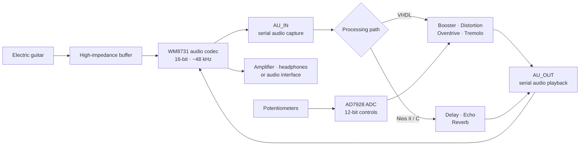

<p align="center">
  
</p>

# FPGA Guitar Multi-Effects Processor

<p align="center">
  <a href="LICENSE"></a>
  
  
  
  
  
  
</p>

A real-time digital guitar multi-effects processor built on the **Terasic DE1-SoC**. The project captures a guitar signal through the board's audio codec, processes each 16-bit sample at approximately 48 kHz, and returns the modified signal through `Line Out`.

It explores two complementary implementation strategies: low-latency audio effects described directly in **VHDL**, and time-domain effects programmed in **C** for an embedded **Nios II** soft-core processor.

> **Engineering value:** this project demonstrates end-to-end hardware/software co-design for real-time digital signal processing: audio-codec control, fixed-width arithmetic, configurable FPGA datapaths, embedded software, ADC-based user controls, analog impedance matching, and laboratory validation with an oscilloscope and real guitar recordings.

## Demo

Click the image to watch the processor running on the DE1-SoC:

<p align="center">
  <a href="https://www.youtube.com/watch?v=zRokwBrkL24">
    
  </a>
</p>

The repository also contains [18 clean and processed audio recordings](Audio-Samples/muestras_audio.zip) covering distortion, overdrive, tremolo, delay, echo, simple reverb, and cathedral reverb.

## Why an FPGA?

Traditional analog pedals are defined by their physical components and wiring. An FPGA makes the signal path reconfigurable: effects can be modified, replaced, or connected in a different order by changing the hardware design. It also allows deterministic sample-by-sample processing without a general-purpose operating system in the critical audio path.

This prototype combines that FPGA datapath with a Nios II processor to compare two approaches:

- **VHDL effects** implement the transformation as dedicated digital hardware.
- **Nios II effects** use software and memory buffers for algorithms that depend on audio history, such as delay and reverberation.

## System architecture



The codec is configured through I²C. Audio samples are exchanged over serial data and synchronization lines, while an **AD7928 eight-channel, 12-bit ADC** reads external potentiometers used to control effect parameters.

## Implemented effects

### FPGA hardware effects

| Effect | Implementation | Controls / behaviour |
| --- | --- | --- |
| **Booster** | VHDL | Clean sample gain or attenuation |
| **Distortion / fuzz** | VHDL hard clipping | Output gain and clipping threshold |
| **Overdrive** | VHDL soft clipping | Output gain and saturation threshold |
| **Tremolo** | VHDL low-frequency amplitude modulation | Rate, depth, and square, sawtooth, or triangular waveform |

The VHDL effects are independent components and can be instantiated or chained in [`testaudio_DE1SoC.vhd`](FPGA-Stompbox/TFG_Stompbox/testaudio_DE1SoC.vhd). The committed top-level revision selects the **distortion** path by default; alternative instantiation examples are preserved in [`NOTAS.txt`](FPGA-Stompbox/TFG_Stompbox/NOTAS.txt).

### Nios II software effects

| Effect | Implementation | Behaviour |
| --- | --- | --- |
| **Bypass** | C | Copies each input sample directly to the output |
| **Delay** | C circular buffer | Mixes the current sample with audio delayed by one second |
| **Echo** | C buffer with feedback | Repeats and progressively attenuates earlier audio |
| **Reverb** | C short feedback buffer | Adds a reflection delayed by approximately 100 ms |
| **Cathedral reverb** | C multi-tap buffer | Combines reflections at approximately 60 ms and 100 ms |

The implementations are collected in [`qsys_bypass.c`](NIOS-Stompbox/nios_audio_system/qsys_bypass.c). They were developed as alternative `main()` routines for the original Altera Nios II workflow.

## Audio path

The project processes mono guitar audio using signed **16-bit two's-complement samples**. The original design configures the codec for a nominal sample rate of **48 kHz**; with the generated 12.5 MHz codec clock, the implemented rate is approximately **48.828 kHz**.

Three reusable VHDL blocks manage the codec:

- [`au_setup.vhd`](FPGA-Stompbox/TFG_Stompbox/au_setup.vhd) configures the codec through I²C.
- [`au_in.vhd`](FPGA-Stompbox/TFG_Stompbox/au_in.vhd) receives serial samples and asserts a `ready` signal.
- [`au_out.vhd`](FPGA-Stompbox/TFG_Stompbox/au_out.vhd) returns processed samples to both output channels.

The design supports 8 kHz, 32 kHz, and 48 kHz configurations, although the effects and delay lengths in this repository were developed for the 48 kHz setting.

## Hardware requirements

- Terasic **DE1-SoC** development board with Cyclone V `5CSEMA5F31C6`
- USB cable for the on-board USB-Blaster II / JTAG interface
- Electric guitar or another mono audio source
- Powered speakers, headphones, amplifier, or audio interface connected to `Line Out`
- Recommended: high-input-impedance buffer between a passive guitar and `Line In`
- For real-time parameter control: up to four 47 kΩ potentiometers connected to the board's ADC header

### Why the impedance buffer matters

A passive guitar pickup is a high-impedance, instrument-level source, while the DE1-SoC `Line In` expects a lower-impedance line-level signal. A direct connection can load the pickup and produce a weak, dull signal with reduced high-frequency response.

The project therefore includes an external unity-gain buffer based on a **TL071** operational amplifier. Its high input impedance and low output impedance preserve the guitar signal before it reaches the codec. The complete circuit, simulation, construction, and measurements are documented in the [project report](TFG-JA_Gumiel-Pedal_de_Efectos.pdf).

## Toolchain

The original project was developed and validated with:

- **Quartus Prime 15.1 Standard Edition**
- **ModelSim SE-64 10.5**
- **Altera Monitor Program 15.1** for Nios II software
- **NI Multisim 13.0** for the analog buffer

The included Quartus project targets the original toolchain. Newer Quartus releases may request an IP or project migration and have not been validated against this historical revision.

## Build and run the VHDL design

### 1. Clone the repository

```bash
git clone https://github.com/jagumiel/Guitar-Pedal-Effects-on-FPGA.git
cd Guitar-Pedal-Effects-on-FPGA/FPGA-Stompbox/TFG_Stompbox
```

### 2. Select or chain an effect

Open [`testaudio_DE1SoC.vhd`](FPGA-Stompbox/TFG_Stompbox/testaudio_DE1SoC.vhd) and instantiate the required effect between `sample_in` and `sample_out`. The current revision enables distortion. Reusable examples for the other effects are available in [`NOTAS.txt`](FPGA-Stompbox/TFG_Stompbox/NOTAS.txt).

For a simple chain, connect the output of one component to the input of the next:

```vhdl
distortion_stage : distortion
port map (
    sample_in  => sample_in,
    dist_pos   => pot_distor,
    gain       => multiplier,
    sample_out => sample_dis
);

tremolo_stage : tremolo
port map (
    sample_in  => sample_dis,
    sample_out => sample_out,
    LD_Sample  => in_ready,
    clk        => CLOCK_50,
    cl         => reset,
    rate       => velocidad,
    atack      => ataque,
    wave       => SW(1 downto 0)
);
```

### 3. Compile

Open the project file in Quartus:

```text
FPGA-Stompbox/TFG_Stompbox/testaudio_DE1SoC.qpf
```

Then select **Processing → Start Compilation**. From a Quartus command shell, the equivalent command is:

```bash
quartus_sh --flow compile testaudio_DE1SoC
```

The SRAM Object File is generated at:

```text
output_files/testaudio_DE1SoC.sof
```

### 4. Program the board

1. Power the DE1-SoC and connect its USB-Blaster interface.
2. Open **Tools → Programmer** in Quartus.
3. Select the detected USB-Blaster hardware.
4. Add `output_files/testaudio_DE1SoC.sof` if it is not already listed.
5. Enable **Program/Configure** and press **Start**.

### 5. Connect the audio path

1. Connect the guitar to the impedance buffer.
2. Connect the buffer output to the DE1-SoC `Line In` connector.
3. Connect `Line Out` to powered speakers, an amplifier, or an audio interface.
4. Connect the parameter potentiometers to the ADC header if the selected effect uses them.
5. Press `KEY0` to reset and initialize the codec.

> Start with the output volume low. Verify the buffer supply, grounds, and ADC voltage range before connecting external circuitry to the board.

## Original build evidence

The committed Quartus reports record a successful build of the VHDL design on 31 August 2017:

| Metric | Recorded result |
| --- | ---: |
| Target device | Cyclone V `5CSEMA5F31C6` |
| Logic utilization | 112 / 32,070 ALMs (`< 1%`) |
| Registers | 162 |
| DSP blocks | 1 / 87 (`1%`) |
| Block memory | 0 / 4,065,280 bits |
| Setup slack, 50 MHz clock | +10.282 ns at slow 85 °C corner |
| Hold slack, 50 MHz clock | +0.327 ns at slow 85 °C corner |

These values describe the committed **distortion-oriented top-level configuration**, not every possible combination of effects. See the original [`flow`](FPGA-Stompbox/TFG_Stompbox/output_files/testaudio_DE1SoC.flow.rpt) and [`timing`](FPGA-Stompbox/TFG_Stompbox/output_files/testaudio_DE1SoC.sta.summary) reports for details.

## Repository structure

```text
.
├── FPGA-Stompbox/
│   └── TFG_Stompbox/          # Quartus project and reusable VHDL effects
├── NIOS-Stompbox/
│   └── nios_audio_system/     # Nios II system artifacts and C effects
├── Audio-Samples/
│   └── muestras_audio.zip     # Clean and processed guitar recordings
├── TFG-JA_Gumiel-Pedal_de_Efectos.pdf
├── LICENSE
└── README.md
```

## Validation approach

The effects were evaluated with several complementary methods:

- A function generator supplied controlled low-frequency waveforms.
- A two-channel oscilloscope compared input and processed output signals.
- Real guitar recordings were captured before and after processing.
- The impedance adapter was simulated and then validated as a physical circuit.
- Delay, echo, and reverb behaviour was checked after removing the input signal and observing the remaining output over time.

This evidence is shown in the [full technical report](TFG-JA_Gumiel-Pedal_de_Efectos.pdf) and the included [audio sample archive](Audio-Samples/muestras_audio.zip).

## Documentation

- **Technical report — Spanish:** [Pedal de efectos digital para guitarra basado en FPGA](TFG-JA_Gumiel-Pedal_de_Efectos.pdf) (90 pages)
- **Project overview — Spanish:** [Pedal de Efectos Digital para Guitarra Eléctrica](https://jagumiel.xyz/blog/2017/10/26/pedal-de-efectos-digital/)
- **Video demonstration:** [Watch on YouTube](https://www.youtube.com/watch?v=zRokwBrkL24)
- **Audio comparisons:** [Download the sample archive](Audio-Samples/muestras_audio.zip)

## Current limitations

This repository preserves the original 2017 Bachelor's degree project and its toolchain. Before treating it as a production-ready or actively maintained audio platform, consider the following:

- Effect selection is performed by editing the VHDL top-level design.
- The repository does not yet provide automated VHDL testbenches or CI.
- The Nios II material contains original source and generated artifacts, but is not packaged as a clean, one-command reproducible Platform Designer build.
- Some VHDL files use legacy Synopsys arithmetic packages alongside `numeric_std`.
- Delay lengths and several gain constants are fixed in the source.
- Overflow handling is deliberately simple and could be improved with explicit saturation arithmetic.
- Generated Quartus and simulation files are still versioned in the repository.

## Roadmap

- [ ] Refactor the audio effects into a clean reusable VHDL library
- [ ] Use `ieee.numeric_std` consistently throughout the design
- [ ] Add run-time effect selection and effect chaining through board switches
- [ ] Add self-checking VHDL testbenches and GHDL-based continuous integration
- [ ] Rebuild and document the Nios II system with a reproducible Platform Designer project
- [ ] Parameterize delay time, feedback, wet/dry mix, clipping threshold, and tremolo controls
- [ ] Add saturating fixed-point arithmetic and automated audio regression tests
- [ ] Remove generated build artifacts and provide a focused Quartus `.gitignore`

## Contributing

Contributions that modernize the toolchain, add an effect, improve the fixed-point DSP, or make the project easier to reproduce are welcome.

1. Fork the repository.
2. Create a topic branch.
3. Keep each effect modular and document its sample format and latency.
4. Include a testbench, waveform, or audio comparison when possible.
5. Open a pull request explaining both the algorithm and its FPGA resource cost.

## Author

**Jose Ángel Gumiel**<br>
Embedded systems, cybersecurity, FPGA, and electronic engineering

- [Personal website](https://jagumiel.xyz/)
- [Technical blog](https://jagumiel.xyz/blog/)
- [GitHub profile](https://github.com/jagumiel)
- [LinkedIn](https://www.linkedin.com/in/jose-%C3%A1ngel-gumiel-quintana)

## License

This project is released under the [MIT License](LICENSE).
